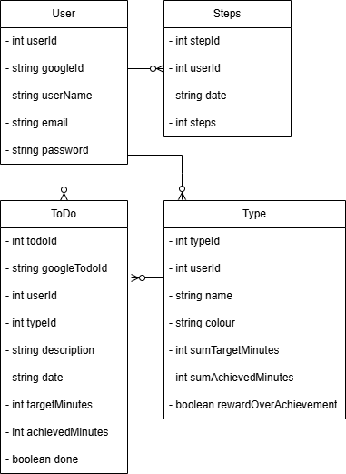

# YouDo – Android Task Manager & Productivity Tracker

YouDo is an Android productivity application designed to help users organize tasks, monitor time usage, and track daily activity in one unified system. The app combines task management, performance analytics, and physical activity tracking to support more balanced and effective daily routines.

---

# Key Features

## Smart Task Management

Create, edit, and manage tasks with a structured lifecycle:

- Task creation with title, description, date, and optional target duration
- Mark tasks as completed while recording the actual time spent
- Edit or delete existing tasks
- Daily task overview with the ability to browse tasks from other dates

## Custom Task Categories

Tasks can be organized into customizable categories:

- Built-in default categories (e.g., work, sport, hobby)
- User-defined categories with custom names and colors
- Ability to delete unused categories
- Category-specific productivity logic

## Productivity Score & Performance Metrics

YouDo analyzes how effectively time is spent on tasks.

- Compares **planned time vs. actual time**
- Calculates **category-based performance percentages**
- Supports two productivity models:
  - Overperformance rewarded (e.g., studying longer)
  - Efficiency rewarded (e.g., completing tasks faster)
- Generates a **Self-Discipline Score**
- Displays motivational feedback messages based on performance levels

## Visual Statistics Dashboard

The app provides visual analytics to help users understand their productivity.

- Category-based **bar charts**
- Comparison of **planned vs. completed time**
- Performance percentage tracking per category
- Real-time updates when task data changes

## Step Counter & Activity Tracking

YouDo integrates hardware sensors to track daily activity.

- Uses Android **Step Counter and Step Detector sensors**
- Runs as a **Foreground Service** to maintain accuracy
- Tracks daily steps even when the app is not open
- Automatically updates UI via broadcast messages

## Google Account & Calendar Integration

The app supports Google ecosystem integration.

- Google Sign-In authentication
- Secure OAuth2 authentication flow
- Synchronization with **Google Calendar**
- Tasks can be aligned with calendar events

---

# Technical Stack & Architecture

The project follows a modular structure inspired by the **MVC (Model–View–Controller)** pattern.

## Language

Java (Android SDK)

## UI / UX

- XML Layouts
- Material Design components
- Responsive interface structure

## Database

- **SQLite** – Local persistence and fast data access
- **Firebase Firestore** – Real-time cloud synchronization

## Authentication

- Firebase Authentication
- Google Sign-In (OAuth2)

## Hardware Integration

- Android Sensor Manager
- Step Counter & Step Detector

## Core Application Components

### Layouts
Defines UI structure and visual components.

### Activities
Handles user interactions and screen logic.

### Models
Core data objects:

- `User`
- `ToDo`
- `Type` (task categories)
- `Step`

### Database Helpers
Handle CRUD operations and database communication.

---

# Productivity Calculation Logic

Performance is calculated by comparing **planned task duration** with **actual time spent**.

Two possible formulas are used depending on the category configuration.

### Overperformance rewarded
performance % = (total actual time / total planned time) × 100

### Efficiency rewarded

performance % = (total planned time / total actual time) × 100

Category results are aggregated into an overall **Self-Discipline Score**.

### Performance feedback levels

- **>100%** → Outstanding performance  
- **100%** → Perfect goal completion  
- **50–99%** → Moderate performance  
- **<50%** → Improvement recommended  

---

# App Demonstrations

Application walkthroughs, diagrams, and screen recordings are available in the **/Design** directory.

---

# Security Note

Sensitive configuration files are excluded from the repository:

- `google-services.json`
- API keys
- SHA fingerprints

These must be generated in your own Firebase project.

---

## Getting Started

### Open in Android Studio
Load the project and allow Gradle to resolve dependencies.

### Install Required SDK
Ensure **Android SDK API 33+** is installed.

### Configure Firebase
Add your own `google-services.json` file to enable:

- Firebase Authentication
- Firestore
- Google Sign-In

### Run the Application
Deployment is optimized for:

- Android 13 (Tiramisu)
- Android 14 (Upside Down Cake)

---

## Future Roadmap

- AI-based task prioritization
- Exportable productivity reports (PDF / CSV)
- Improved historical analytics
- Extended compatibility for older and newer Android versions

---

## Feedback

This is a personal development project.

Technical feedback and suggestions are welcome via **GitHub Issues**.